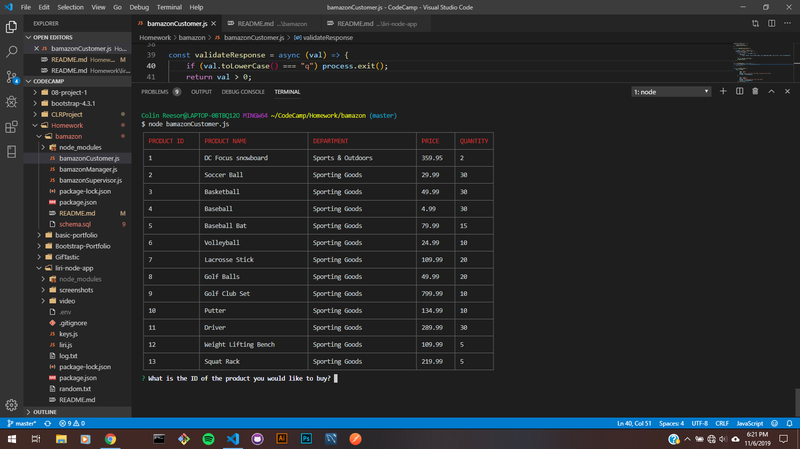
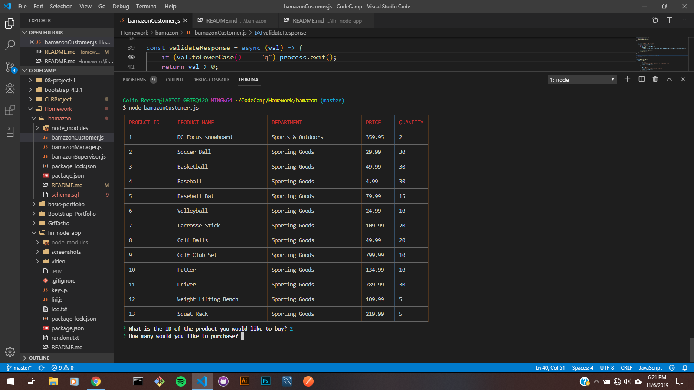
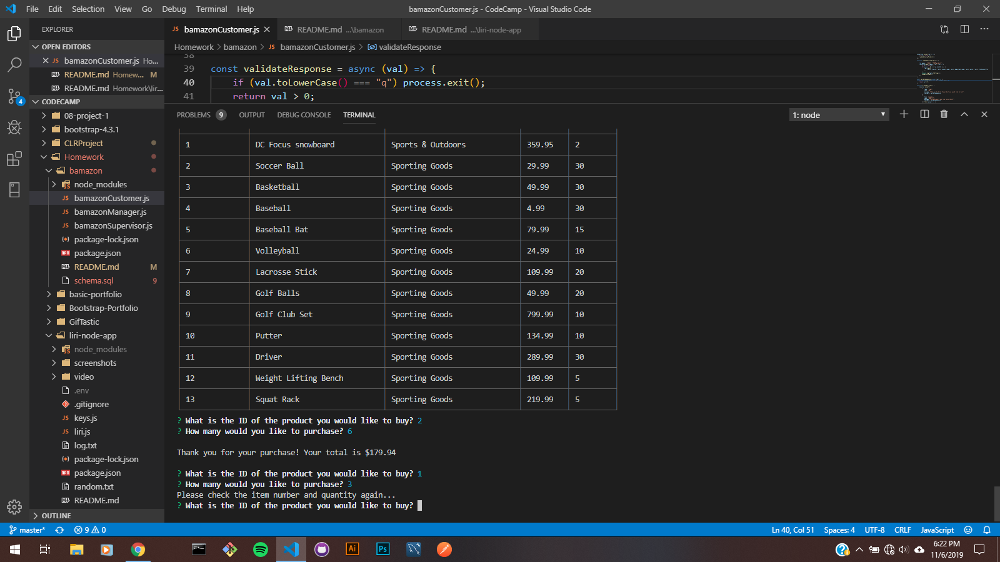
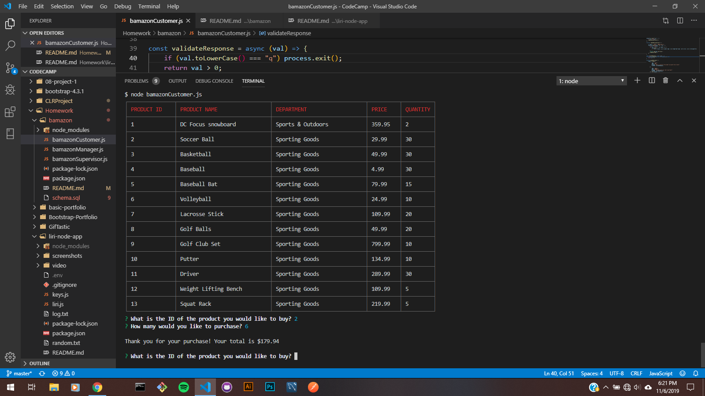

# bamazon
Amazon storefront CLI app that allows a customer to make a purchase based on the item list displayed
****
## Bamazon - The What and Why
Bamazon makes it easy and convenient for a user to go online and make purchases from a list of items.
****
## Overview
Bamazon uses Node packages for CLI-table, Inquirer and MySql to allow a decent interactive experience with the storefront.
****
## Bamazon Commands
1. Type "node bamazonCustomer":
    1) It will ask you for the **ID** of the item you'd like to purchase.
    2) Next, you will need to enter in the **quantity** of the item you'd like. If there aren't enough items available, Bamazon will let you know.
    3) At this point, you can either make another purchase or press **q** to quit.
****
## Screenshots

### Item List

****

### Choosing an Item

****

### Entering the Quantity

****

### User Error

****

### Purchase Total

****

## Tech used by Bamazon

### **MySQL**
Database records
### **Node Package Manager**
MySQL, Inquirer, CLI-table

****

## Development

Colin Reesor created this version of the Bamazon!

****

## Demo Video

Check out the [live demo](https://drive.google.com/file/d/1QGMC6SDGJ_APvGNAYuvXp_zndi0ekkng/view)